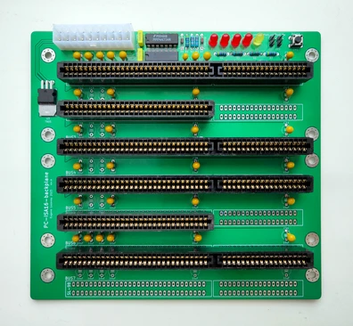

## ISA16-BACKPLANE
Compact ISA 16-bit backplane board

Specs:
- 171x155mm
- 7 ISA 16-bit (98 pin) slots
- ATX 20 pin power supply connector
- ATX power control circuit
- LEDs for +5V, +12V, -5V, -12V and standby power rails
- Power button
- Headers for power button and +5V power led

### Changelog
* Rev.A - first release
* Rev.A1 - ATX connector changed from 5.5mm to 4.4mm and rotated 180°

### See also
* ISA 8-bit backplane by Sergey Kiselev: [link](https://github.com/skiselev/isa8_backplane)
* ISA 16-bit backplane by Alexandru Groza: [link](https://alexandrugroza.ro/microelectronics/system-design/isa-backplane/index.html)
